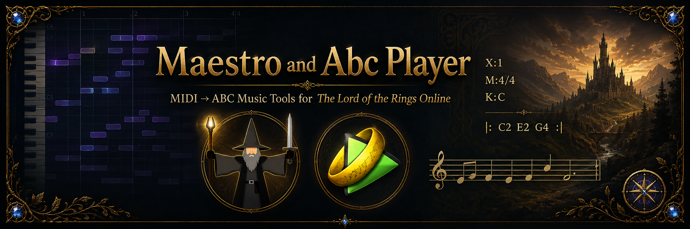

  

<!-- Project -->

  
  
  
  

<!-- Development -->

  
  
  
  
  
  

<!-- Technologies / Formats -->

  
  
  
  
  
  
  

  
  
  
  

# Maestro and Abc Player

**Maestro** and **Abc Player** are music tools for [The Lord of the Rings Online](https://www.lotro.com/), built around LOTRO's player music and ABC notation system.

Maestro is primarily a **MIDI → ABC transcription and arrangement tool**. It helps musicians turn MIDI files into arrangements suitable for LOTRO by assigning parts to instruments, adapting music to the capabilities of the game, previewing the result, and exporting ABC files.

Abc Player complements Maestro by providing an **offline player for LOTRO ABC files**, allowing arrangements to be previewed and checked before performing them in-game.

## Maestro

Maestro is the arrangement and transcription component of the toolset.

It can be used to:

* Import MIDI files.
* Inspect and arrange MIDI tracks.
* Create parts for LOTRO musicians and bands.
* Assign parts to LOTRO instruments.
* Transpose music and adapt it to instrument ranges.
* Adjust tempo and other export settings.
* Preview arrangements while working on them.
* Export LOTRO-compatible ABC notation.
* Create multi-part arrangements for ensemble performances.

## Abc Player

Abc Player is designed for reviewing and playing LOTRO ABC arrangements outside the game.

It can be used to:

* Open and play ABC files.
* Preview LOTRO arrangements before using them in-game.
* Play multiple ABC parts together.
* Review timing and instrumentation.
* Follow an arrangement while listening to it.
* Check multi-part songs before a band performance.

## Requirements

* **Java 21 or newer**
* **Windows** or **Linux**

See the [latest releases](https://github.com/NikolaiVChr/maestro/releases) for current builds.

## Documentation

Project documentation is available on the **[Maestro Wiki](https://maestro.miraheze.org/)**.

The wiki contains information about Maestro, Abc Player, instruments, configuration, music arrangement and the LOTRO ABC workflow.

For questions, discussion, development feedback or contact with other users, join the **[Maestro Discord](https://discord.gg/f7hGqmY9xF)**.

## LOTRO Music Resources

LOTRO has had an active player-music community for many years. The following sites contain useful documentation, discussions, ABC collections and related tools.

### Documentation

* **[Maestro Wiki](https://maestro.miraheze.org/)**
  Documentation for Maestro and Abc Player.

* **[LOTRO-Wiki — Music](https://lotro-wiki.com/wiki/Music)**
  Community documentation about LOTRO's player music system, instruments and related mechanics.

* **[ABC notation](https://abcnotation.com/)**
  General documentation and resources for the ABC music notation format.

* **[ABC notation — LOTRO / MMORPG resources](https://abcnotation.com/mmorpg)**
  ABC resources specifically related to LOTRO and other games. The site also lists Maestro and Abc Player.

### Community

* **[LOTRO Forums](https://forums.lotro.com/)**
  The official LOTRO forums include a dedicated **Music and Musicians** section for music creation, bands, performances and discussion.

* **[Bards of a Feather](https://www.bardsofafeather.net/)**
  Long-running LOTRO music community with guides, links and music resources.

### ABC Libraries

* **[Bards of a Feather Music Library](https://www.bardsofafeather.net/library.html)**
  A collection of LOTRO ABC resources and links to community music collections.

* **[The Fat Lute and Other .ABC Music Archive](https://www.lotrointerface.com/downloads/info1087-TheFatLuteandOther.ABCMusicArchive.html)**
  Archive preserving ABC files from the historic Fat Lute collection and several other sources.

### Related Music Tools

The LOTRO music community maintains several different **Songbook / Music Book** plugins, forks and standalone tools for organizing, selecting and performing ABC music in-game.

Because these projects change over time and new forks continue to appear, this README does not attempt to maintain a complete list.

For an up-to-date overview of currently available Songbook variants and related LOTRO music tools, see the **[Maestro Discord](https://discord.gg/f7hGqmY9xF)**.

Additional LOTRO plugins and utilities can also be found on **[LOTROInterface](https://www.lotrointerface.com/)**.

## Project History

Maestro and Abc Player were originally created by **Digero of Landroval**.

They are currently maintained and further developed by **Aifel of Meriadoc** and **Elamond of Peregrin**.

**Karloman** has also contributed to the codebase.

The project continues the original Maestro and Abc Player codebase while maintaining compatibility with current Java versions, operating systems, LOTRO instruments and the needs of the LOTRO music community.

## Contributing

Contributions, bug reports and improvements are welcome.

You can:

* Report bugs or request features through [GitHub Issues](https://github.com/NikolaiVChr/maestro/issues).
* Discuss the project on [Discord](https://discord.gg/f7hGqmY9xF).
* Submit improvements through GitHub pull requests.

See the [contributors page](https://github.com/NikolaiVChr/maestro/graphs/contributors) for people who have contributed to the project.

## Credits and Data Sources

XG, GS and GM2 instrument and drum kit names — excluding individual drum hit names — are largely based on data from **[JZZ-midi-GM](https://github.com/jazz-soft/JZZ-midi-GM)**.

Thanks to the LOTRO music community for maintaining tools, documentation, ABC collections and knowledge surrounding the game's music system.

## License

Maestro and Abc Player are open-source software licensed under the **[MIT License](LICENSE)**, except where otherwise indicated. Third-party code, libraries, tools, data, assets and other incorporated resources are governed by their respective licenses and copyright terms.
